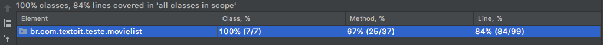

# Texo IT - Exercício

### Desenvolva uma API RESTful para possibilitar a leitura da lista de indicados e vencedores da categoria Pior Filme do Golden Raspberry Awards.


* Fiz o exercício com Java 11, Spring boot 2.5.6 com JPA, H2, Rest repositorys, opencsv, commons-io e RestAssured para o teste
* Usei conceitos de arquitetura hexagonal separando o domain da infra e usando ports e adapters.
* Toda a parte de infra está no pacote *br.com.textoit.teste.movielist.infra*
* Toda a parte do domain está no pacote *br.com.textoit.teste.movielist.domain*
* A api está no pacote *br.com.textoit.teste.movielist.adapters* com seu Controller, DTOs e configurações


# Sobre a solução

 * no startup o banco H2 é carregado com os dados do CSV
 * Quando há mais de um producer, estou carregando uma linha na base de dados pra cada um deles;
 * Não usei alias na consulta por falta dessa feature no H2;
 * O único teste faz uma chamada na API e traz os dados conforme o que foi passado na especificação;
 * O banco de dados poderá ser acessado [nesse link](http://localhost:8080/h2-console)
 * Implementado com base no nível 2 de maturidade de Richardson, uma api GET acessada através da URI [http://localhost:8080/filmeEntity/intervalos](http://localhost:8080/filmeEntity/intervalos)
 * Não usei lombok para fins didáticos mas normalmente uso nos projetos;

# Cobertura dos Testes


* Obs: Tanto a % de métodos quanto a de linhas fica um pouco abaixo por conta de getters não usados diretamente mas necessários na hora da API ler o pojo.

# Rodar o projeto

Na pasta raiz do projeto executar o comando abaixo que vai rodar o teste e gerar um jar na pasta /target

```
mvn clean install
```

Executar em seguida o comando abaixo

```
java -jar target/movie-list.jar
```

